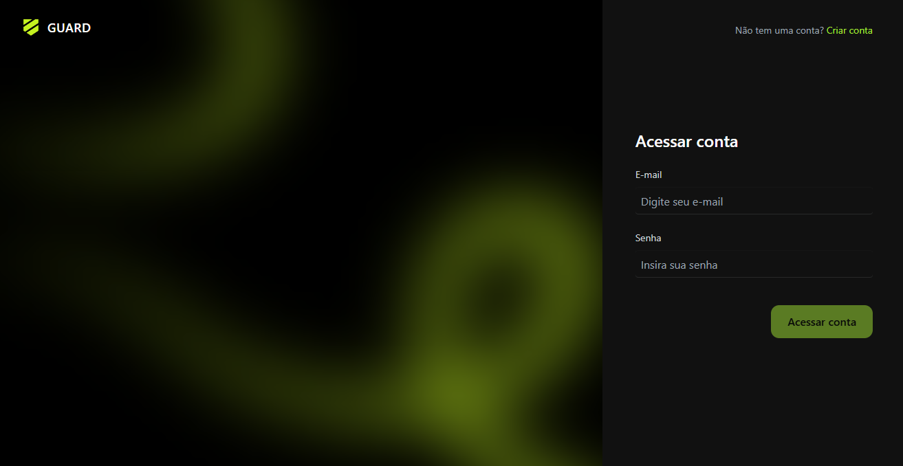
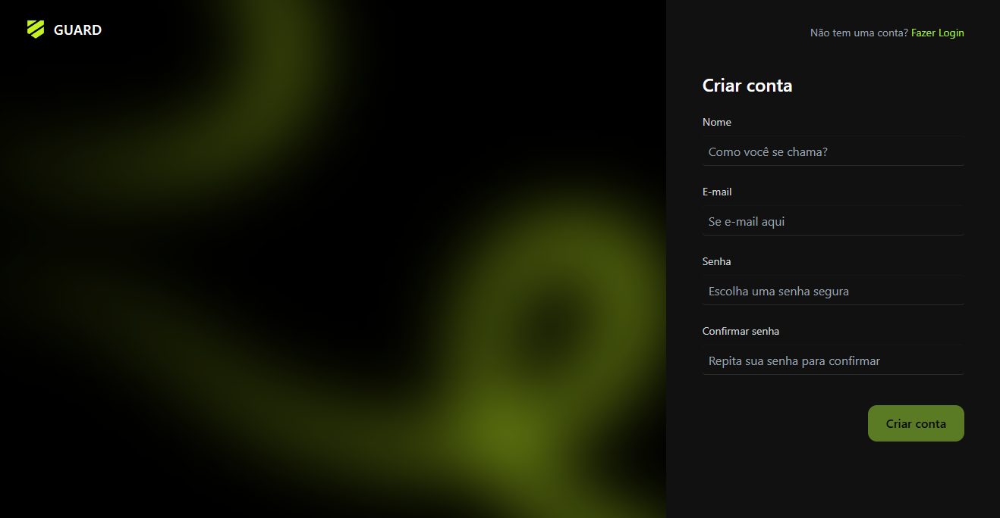
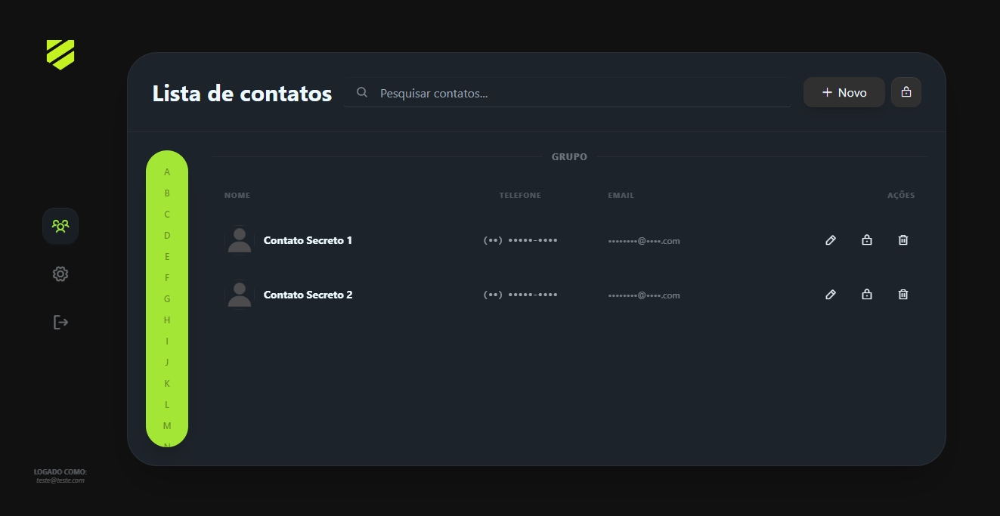
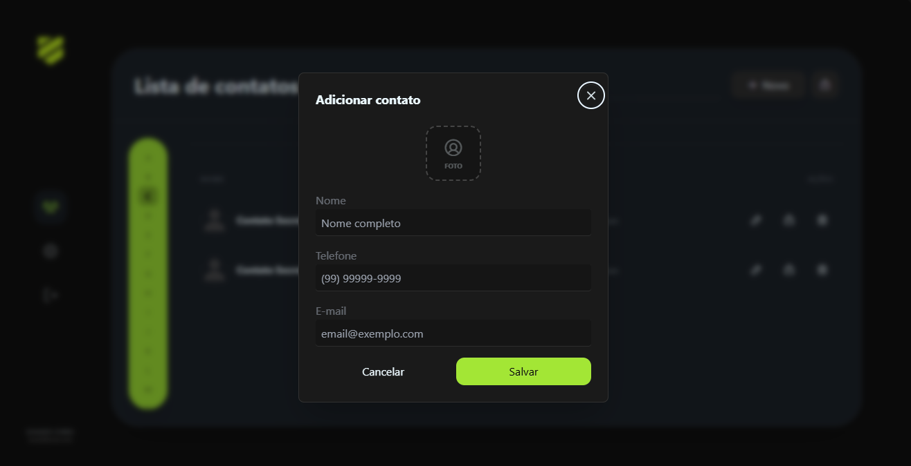
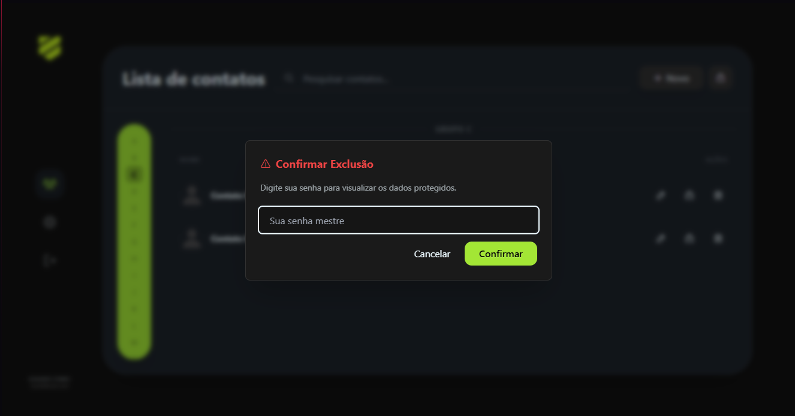

# 📇 Contact Manager PHP

Uma aplicação de gerenciamento de contatos desenvolvida em PHP, agora atualizada com uma camada interativa em JavaScript para uma experiência de usuário (UX) fluida e segura.

> Este projeto evoluiu do lock-contact-php para um sistema dinâmico que utiliza chamadas assíncronas e criptografia de dados.









---

## ✨ Funcionalidades

* **Autenticação Completa:** Sistema de login e registro com Middlewares de proteção (`Auth` e `Guest`).
* **Gestão de Contatos (CRUD):** Criação, leitura, edição e exclusão de contatos.
* **Segurança de Dados:** Criptografia para campos sensíveis (E-mail e Telefone) no banco de dados.
* **Revelação por Senha:** Dados sensíveis ficam ocultos por padrão e só são revelados após confirmação da senha do usuário.
* **Busca em Tempo Real:** Pesquisa de contatos com técnica de *Debounce* para evitar múltiplas requisições ao servidor.
* **Exclusão de Conta com Cascade:** Opção para o usuário deletar sua conta, removendo automaticamente todos os seus contatos (SQLite FK Support).

---

## 🚀 O que há de novo? (Atualização JS)

Nesta versão, o projeto deixou de ser puramente focado em recarregamento de página (SSR) e passou a integrar uma lógica de  **Frontend Dinâmico** :

1. **Modais Interativos:** Uso de componentes reutilizáveis para Configurações, Confirmação e Formulários.
2. **Validação Assíncrona (Fetch API):** Os formulários são enviados via JavaScript, permitindo exibir erros de validação em tempo real sem perder o estado da página.
3. **Method Spoofing:** Implementação de suporte a métodos `PUT` e `DELETE` em formulários HTML através de campos ocultos (`__method`).
4. **UI/UX Progressiva:**
   * Preview de avatar antes do upload.
   * Feedback visual de erro nos inputs.
   * Toggle de visibilidade de dados sem recarregar a lista.

---

## 🛠️ Tecnologias Utilizadas

### **Backend**

* **Linguagem:** PHP 8.x
* **Arquitetura:** MVC (Model-View-Controller)
* **Banco de Dados:** SQLite
* **Segurança:** Password Hashing (Bcrypt) e Criptografia OpenSSL.

### **Frontend**

* **JavaScript:** Vanilla JS (ES6+) com Fetch API.
* **Estilização:** Tailwind CSS & DaisyUI.
* **Ícones:** Phosphor Icons.

---

## 📂 Estrutura de Pastas Principal

**Plaintext**

```
app/
 ├── Controllers/   # Lógica de controle (Contact, Setting, Login...)
 ├── Middlewares/   # Filtros de acesso (Auth, Guest)
 ├── Models/        # Camada de dados (User, Contact)
config/             # Definições de rotas e sistema
Core/               # O coração do framework (Router, Database, Validation)
views/              # Templates PHP e componentes de UI
public/             # Arquivos estáticos (JS, CSS, Imagens)
```

---

## 🔧 Instalação e Uso

1. **Clonar o repositório:**
   **Bash**

   ```
   git clone https://github.com/VictorIshizuka/contact-manager-php.git
   ```
2. **Instalar dependências (Composer):**
   **Bash**

   ```
   composer install
   ```
3. **Configurar o Banco:**

   * Certifique-se de que o SQLite está ativo.
   * O banco será criado automaticamente ou aponte para seu arquivo `.db` no `.env`.
4. **Habilitar Foreign Keys no SQLite:**
   O sistema executa automaticamente `PRAGMA foreign_keys = ON;` para garantir a integridade dos dados..

---


## 👨‍💻 Autor

*Desenvolvido por Victor Ishizuka.*
